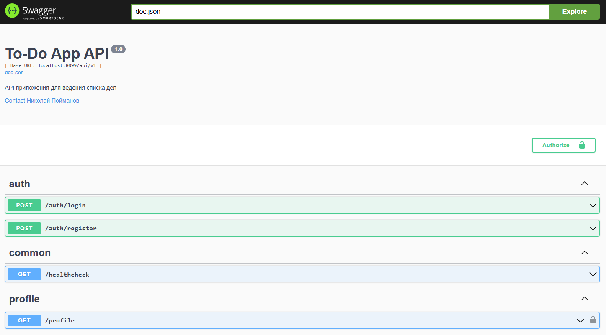

# To Do App (API)

   

Приложение для ведения списка задач (API).

### Функционал

- Пользователи могут регистрироваться и аутентифицироваться;
- Пользователи могут создавать задачи;
- Пользователи могут обновлять описание задачи;
- Пользователи могут обновлять статус завершенности задачи (завершена или нет);
- Пользователи могут удалять задачи;
- Пользователи могут получать данные своего профиля.

### Предварительные требования

Для запуска приложения требуется **Docker** и **Docker Compose**.

### Основные команды

| Команда                           | Описание                                                      |
|:----------------------------------|:--------------------------------------------------------------|
| `make init`                       | Инициализация приложения                                      |
| `make up`                         | Запуск приложения                                             |
| `make down`                       | Остановка приложения                                          |
| `make restart`                    | Перезапуск приложения                                         |
| `make shell`                      | Вход в консоль контейнера с приложением                       |
| `make copy-configs`               | Копирование конфигов для локальной разработки                 |
| `make migrate`                    | Запуск миграций БД                                            |
| `make logs`                       | Отображение логов приложения и БД                             |
| `make generate-swagger`           | Генерация Swagger-документации                                |
| `make format-swagger`             | Форматирование аннотаций Swagger-документации в исходном коде |
| `make test`                       | Запуск тестов                                                 |
| `make lint`                       | Запуск линтера                                                |
| `make check`                      | Запуск тестов и линтера                                       |
| `make generate-repository-mock`   | Создание mock-файла для репозиториев                          |
| `make generate-service-mock`      | Создание mock-файла для сервисов                              |
| `make generate-mock`              | Создание mock-файлов для репозиториев и сервисов              |

### Интерфейсы

Приложение - http://localhost:8099/api/v1

Документация - http://localhost:8099/swagger/index.html

---

Код написан в образовательных целях.